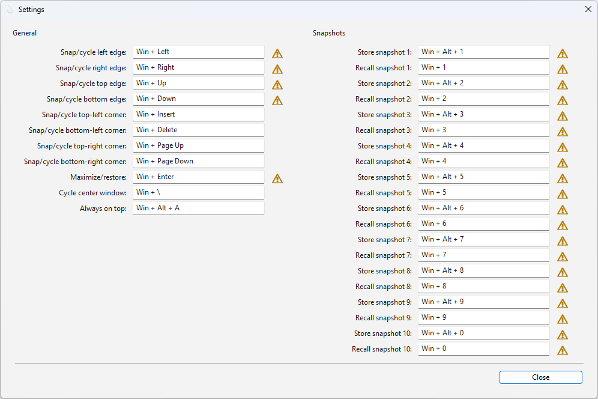
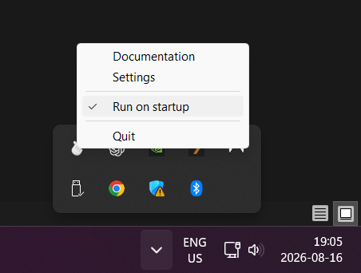

<p align="center">
  
</p>

# Znap

A dependency-free hotkey oriented window manager for Windows 10 & 11 inspired by Rectangle for MacOS, with additional window layout snapshot store/recall functionality. 

## Default Hotkeys

| Action | Shortcut |
| --- | --- |
| Cycle the left edge through 1/2, 2/3, and 1/3 width | `Win` + `Left` |
| Cycle the right edge through 1/2, 2/3, and 1/3 width | `Win` + `Right` |
| Cycle the top edge through 1/2, 2/3, and 1/3 height | `Win` + `Up` |
| Cycle the bottom edge through 1/2, 2/3, and 1/3 height | `Win` + `Down` |
| Cycle the top-left corner through 1/2, 2/3, and 1/3 width | `Win` + `Insert` |
| Cycle the top-right corner through 1/2, 2/3, and 1/3 width | `Win` + `Page Up` |
| Cycle the bottom-left corner through 1/2, 2/3, and 1/3 width | `Win` + `Delete` |
| Cycle the bottom-right corner through 1/2, 2/3, and 1/3 width | `Win` + `Page Down` |
| Cycle a centered, full-height window through 1/2, 2/3, and 1/3 width | `Win` + `\` |
| Toggle maximize, restoring the previous state or a centered state if unknown | `Win` + `Enter` |
| Toggle always-on-top | `Win` + `Alt` + `A` |
| Store the currently fully visible windows and window focus in snapshot 1–9 or 0 (ignoring always-on-top overlays) | `Win` + `Alt` + `1`–`9` or `0` |
| Recall snapshot 1–9 or 0, raise its windows, promote them in Alt+Tab, and restore focus | `Win` + `1`–`9` or `0` |

The notification-area menu opens the settings dialog, links to the original documentation, toggles launch at sign-in, and exits the application.
Successfully stored windows briefly wiggle down and back up as confirmation.

## Settings

Select **Settings** from Znap's notification-area menu to view and remap the general window-management and snapshot shortcuts. Click a shortcut field, then press a non-modifier key while holding at least one modifier key (`Win`, `Ctrl`, `Alt`, or `Shift`) to record the new shortcut. Press `Backspace` while recording to clear a shortcut.

Changes are saved immediately to `%USERPROFILE%\.config\znap\settings.json` and loaded the next time Znap starts. Assigning a shortcut that is already used by another Znap action clears the duplicate assignment. A yellow warning icon identifies shortcuts that collide with a global Windows shortcut; hover over it for more information.

When Windows window snapping is enabled, the dialog also provides a warning and a shortcut to the relevant Windows settings page.



## Run on startup

Select **Run on startup** from Znap's notification-area menu to toggle automatic launch when the current Windows user signs in. A check mark beside the menu item indicates that automatic launch is enabled. Selecting it again disables automatic launch. This setting applies only to the current user and does not require administrator privileges.



## Build

Install Zig 0.16.0, then run:

```powershell
zig build -Doptimize=ReleaseSafe
```

The executable is written to `zig-out/bin/Znap.exe`. No external dependencies are required.

Run the unit tests with:

```powershell
zig build test
```

## Install / Start

Save Znap.exe anywhere on your hard drive and run it (if you build from source you can just keep it in the projects zig-out folder).

## Implementation

The application calls Win32 directly. Its C declarations are generated at build time with Zig's `addTranslateC`; window geometry and saved maximize states are kept in platform-independent modules with unit tests. It uses per-monitor-v2 DPI awareness, DWM extended frame bounds, monitor work areas, a low-level keyboard hook, a native notification-area icon, and the current-user `Run` registry key.

## License and attribution

The window snapping functionality is a Zig-language port of RectangleWin by Ahmet Alp Balkan. It preserves the upstream behavior and is distributed under the Apache License 2.0. See [LICENSE](LICENSE) and [NOTICE](NOTICE).

