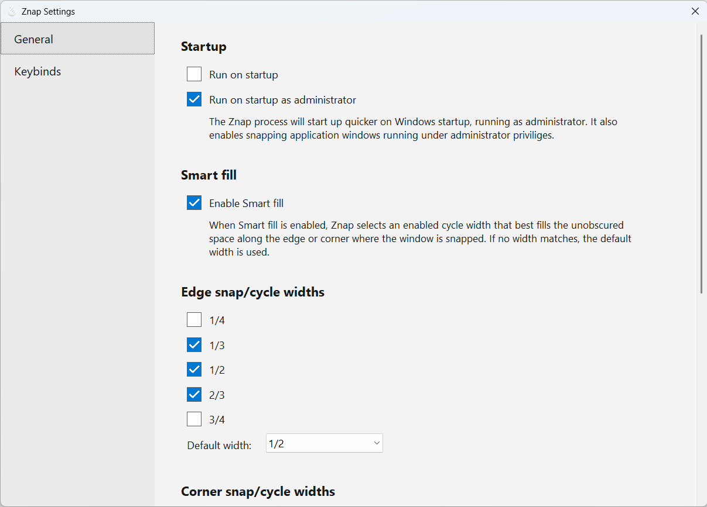
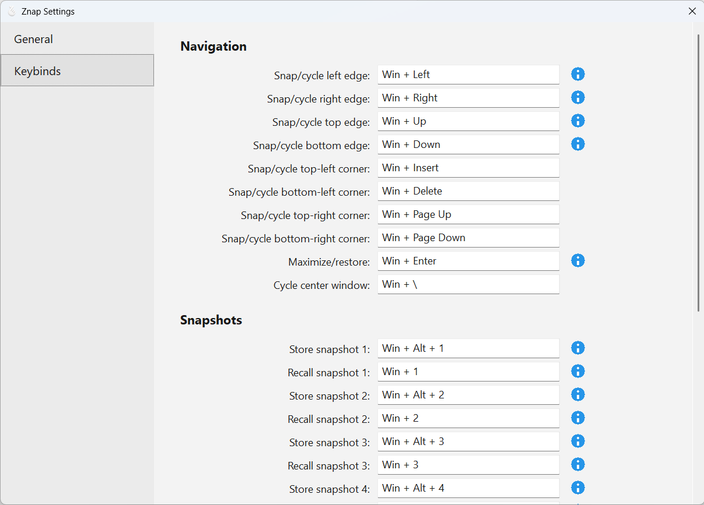

<p align="center">
  
</p>

# Znap

Znap is a fast, hotkey-driven window manager for Windows 10 and 11. Snap windows to screen edges and corners, cycle through useful sizes, or save and restore complete window layouts—all from a single dependency-free executable.

## What Znap does

- Snaps windows to an edge or corner and cycles through configurable sizes when you repeat the shortcut.
- Centers and maximizes windows without reaching for the mouse.
- Stores and recalls up to ten window-layout snapshots, including window order and focus.
- Uses Smart fill to select an enabled size that best fits the unobscured space beside other snapped windows.
- Lets you customize every shortcut and choose the available and default snap sizes.

## Install and start

Place `Znap.exe` anywhere you like and run it. Znap stays in the Windows notification area; right-click its icon to open Settings or Documentation, or to exit.

Znap uses several `Win` + arrow shortcuts that overlap with Windows' built-in Snap windows feature. When that feature is enabled, Znap provides a link to the relevant Windows setting so you can disable it for more predictable behavior.

## Default shortcuts

| Action | Shortcut |
| --- | --- |
| Snap/cycle left edge | `Win` + `Left` |
| Snap/cycle right edge | `Win` + `Right` |
| Snap/cycle top edge | `Win` + `Up` |
| Snap/cycle bottom edge | `Win` + `Down` |
| Snap/cycle top-left corner | `Win` + `Insert` |
| Snap/cycle top-right corner | `Win` + `Page Up` |
| Snap/cycle bottom-left corner | `Win` + `Delete` |
| Snap/cycle bottom-right corner | `Win` + `Page Down` |
| Center and cycle width | `Win` + `\` |
| Maximize/restore | `Win` + `Enter` |
| Store snapshot 1–9 or 0 | `Win` + `Alt` + `1`–`9` or `0` |
| Recall snapshot 1–9 or 0 | `Win` + `1`–`9` or `0` |

Repeated snap shortcuts cycle through the enabled sizes. By default, Znap starts at one-half and cycles through two-thirds and one-third. A stored layout briefly moves its windows down and back as confirmation.

## Settings

Open **Settings** from Znap's notification-area menu. Changes are saved immediately.

### General

Choose how Znap starts with Windows, enable Smart fill, and configure the sizes used for edge, corner, and center cycles. Each group must have at least one enabled size, and its **Default width** is used for the first snap when Smart fill does not find a match.

The two startup modes are mutually exclusive but always selectable. **Run on startup as administrator** requires administrator approval and also lets Znap snap application windows running with elevated privileges.



### Keybinds

Click a shortcut field, then press a non-modifier key while holding at least one modifier (`Win`, `Ctrl`, `Alt`, or `Shift`). Press `Backspace` while recording to clear the shortcut.

Assigning a shortcut already used by another Znap action clears the duplicate. A blue information icon indicates that a shortcut overlaps a global Windows shortcut; hover over it for details.



### Snapshots

Captured snapshots list one application record for every captured top-level window, including multiple windows owned by the same process. Enable **Auto Start Applications** to persist the captured window layout, executable, and App User Model ID, edit optional launch arguments or working directories, and start missing applications when that snapshot is recalled. Application fields are read-only until auto start is enabled. Missing Windows Terminal records are launched as separate Terminal windows. If an application cannot be launched or does not create a matching window, Znap reports the failed snapshot and application through a Windows notification.

Each captured window also receives a persistent logical window ID. When the same window is included in multiple snapshots, those records share the ID and resolve to the same runtime HWND. Distinct windows from the same application retain different IDs, including Windows Terminal windows.

Editing an application's executable, arguments, working directory, or App User Model ID updates every snapshot record that references the same logical window.

When Auto Start Applications is enabled, a snapshot can only be updated while exactly the same captured windows are present. An update with a different window set is rejected and reported through a Windows notification; disable auto start first when intentionally replacing the snapshot with different windows.

The settings window follows the Windows light, dark, and high-contrast themes and supports display scaling.

## Build from source

Install Zig 0.16.0 and run:

```powershell
zig build -Doptimize=ReleaseSafe
```

The executable is written to `zig-out/bin/Znap.exe`.

## License and attribution

Znap's window-snapping functionality is a Zig port of RectangleWin by Ahmet Alp Balkan. It preserves the upstream behavior and is distributed under the Apache License 2.0. See [LICENSE](LICENSE) and [NOTICE](NOTICE).
